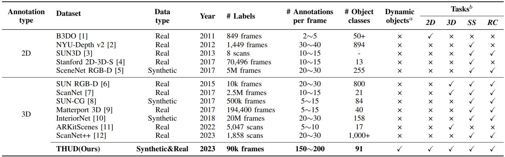
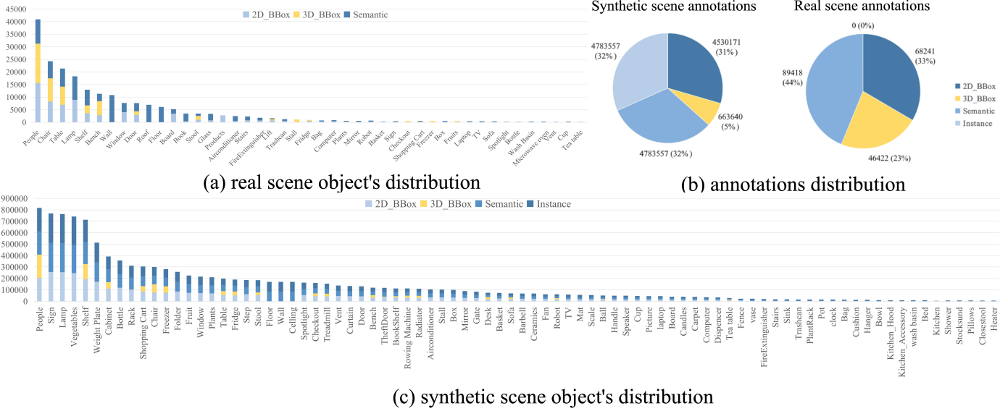

# THUD

We present a mobile robot oriented large-scale indoor dataset, denoted as THUD (Tsinghua University Dynamic) robotic dataset, for training and evaluating their dynamic scene understanding algorithms. Specifically,
the THUD dataset construction is first detailed, including organization, acquisition, and annotation methods. It comprises
both real-world and synthetic data, collected with a real robot platform and a physical simulation platform, respectively. Our current dataset includes 13 larges-scale dynamic scenarios, 90K image frames, 20M 2D/3D bounding boxes of static and dynamic objects, camera poses, and IMU. The dataset is still continuously expanding. Then, the performance of mainstream indoor scene understanding tasks, e.g. 3D object detection, semantic segmentation, and robot relocalization, is evaluated on our THUD dataset. These experiments reveal serious challenges for some robot scene understanding tasks in dynamic scenes. By sharing this dataset, we aim to foster and iterate new mobile robot algorithms quickly for robot actual working dynamic environment, i.e. complex crowded dynamic scenes.

## Homepage
### Website
You can have a detailed understanding of our project from this [website](https://jackyzengl.github.io/THUD-Robotic-Dataset.github.io/).

### Download
If you want to use our dataset, please carefully read our instructions (see Homepage) and truthfully fill in the required information, which is important for us.

## Dataset comparison
The THUD dataset has unique advantages compared to other publicly available datasets, and the differentiation of the THUD dataset can be directly felt in the table below.


## Dataset structure
The THUD dataset contains 8 real scenes and 5 synthetic Scenes. For ease of use, we have uniformly processed the structure of the dataset. For most scenarios, they have similar structures:
##
- THUD
  - Real_Scenes
    - Store
      - static
        - Capture_1
          - Camera_intrinsics
            - camera-intrinsics.txt
          - Depth
            - frame-000000.depth.png
            - frame-000001.depth.png
            - ...
          - Label
            - 2D_Object_Detection
              - frame-000000.json
              - frame-000001.json
              - ...
            - 3D_Object_Detection
              - frame-000000.txt
              - frame-000001.txt
              - ...
            - Pose
              - frame-000000.pose.txt
              - frame-000001.pose.txt
              - ...
            - Semantic
              - frame-000000.png
              - frame-000000.png
              - ...
          - Pointcloud
            - frame-000000.point.ply
            - frame-000001.point.ply
            - ...
          - RGB
            - frame-000000.color.png
            - frame-000001.color.png
            - ...
        - Other Cpature(Same structure as Capture_1)
      - dynamic(Same structure as static)
    - Other Scenes(Same structure as Store)
  - Synthetic_Scenes
    - Gym
      - static
        - Capture_1
          - Depth
            - depth_0.png
            - depth_1.png
            - ...
          - Label
            - annotation_info
              - annotation_definitions
                - bounding box
                  - description.txt
                  - format.txt
                  - id.txt
                  - label_num.txt
                  - name.txt
                  - spec.txt
                - bounding box 3D(Same structure as bounding box)
                - instance segmentation(Same structure as bounding box)
                - semantic segmentation(Same structure as bounding box)
              - version
                - info.txt
              - annotation_definitions.json
              - metric_definitions.json
              - metrics_000.json
              - sensors.json
            - Instance
              - Instance_0.png
              - Instance_1.png
              - ...
            - Semantic
              - Segmentation_0.png
              - Segmentation_1.png
              - ...
            - captures_000.json
            - captures_001.json
            - ...
          - RGB
        - Other Cpature(Same structure as Capture_1)
      - dynamic(Same structure as static)
    - Other Scenes(Same structure as Gym)
##
Especially, due to the large area of some scenes, partitioning was used for collection (the poses in different partitions are still consistent), such as in Real_Scenes's Canteen:
##
- THUD
  - Real_Scenes
    - canteen
      - dynamic
        - part_1
          - Capture_1
          - Capture_2
        - part_2
        - part_3
    - other scenes
##
## Data processing script
Real scene data is collected using independent frames as the collection unit. When summarizing the dataset, it has already been processed into an independent and usable form (refer to the file directory). Synthetic scene data is collected in a serialization manner, and some annotated data exists in a long serialization form in the JSON file. We have prepared the original synthetic dataset and data processing scripts for researchers to quickly process the simulation dataset. In addition, we have also prepared other scripts for use. For details, please refer to:
 ```Data_processing```.
As long serialization labels in synthetic scene:
```
{
  "version": "0.0.1",
  "captures": [
    {
      "id": "aba6a888-1ef3-40bd-b872-57140e8eb1d0",
      "sequence_id": "a334f33c-c54d-41fe-8bd8-28ca96f3176a",
      "step": 0,
      "timestamp": 0.0166,
      "sensor": {
        "sensor_id": "camera_0",
        "ego_id": "ego",
        "modality": "camera",
        "translation": [
          4.38104,
          1.32004654,
          14.0407724
        ],
        "rotation": [
          0.0,
          -0.7071068,
          0.0,
          0.7071068
        ],
        "camera_intrinsic": [
          [
            1013.88892,
            0.0,
            365.0
          ],
          [
            0.0,
            1520.83325,
            265.0
          ],
          [
            0.0,
            0.0,
            1.0
          ]
        ],
        "projection": "perspective"
      },
      "ego": {
        "ego_id": "ego",
        "translation": [
          0.0,
          0.0,
          0.0
        ],
        "rotation": [
          0.0,
          0.0,
          0.0,
          1.0
        ],
        "velocity": null,
        "acceleration": null
      },
      "filename": "RGB0ce33018-a50f-4219-a696-aa7b21a9aec8/rgb_2.png",
      "format": "PNG",
      "annotations": [
        {
          "id": "bounding box 3D",
          "annotation_definition": "bounding box 3D",
          "values": [
            {
              "label_id": 4,
              "label_name": "Rowing Machine",
              "instance_id": 304,
              "translation": {
                "x": -1.59077168,
                "y": -1.0058285,
                "z": 9.859168
              },
              "size": {
                "x": 0.7041397,
                "y": 0.593877,
                "z": 2.18156719
              },
              "rotation": {
                "x": 0.0,
                "y": 0.0,
                "z": 0.0,
                "w": 1.00000012
              },
              "velocity": {
                "x": 0.0,
                "y": 0.0,
                "z": 0.0
              },
              "acceleration": {
                "x": 0.0,
                "y": 0.0,
                "z": 0.0
              }
            },
            {
              "label_id": 4,
              "label_name": "Rowing Machine",
              "instance_id": 311,
              "translation": {
                "x": -2.70577145,
                "y": -1.0058285,
                "z": 9.859169
              },
              "size": {
                "x": 0.7041397,
                "y": 0.593877,
                "z": 2.18156719
              },
              "rotation": {
                "x": 0.0,
                "y": 0.0,
                "z": 0.0,
                "w": 1.00000012
              },
              "velocity": {
                "x": 0.0,
                "y": 0.0,
                "z": 0.0
              },
              "acceleration": {
                "x": 0.0,
                "y": 0.0,
                "z": 0.0
              }
            },
            {
              "label_id": 4,
              "label_name": "Rowing Machine",
              "instance_id": 108,
              "translation": {
                "x": -3.77677178,
                "y": -1.0058285,
                "z": 9.859169
              },
              "size": {
                "x": 0.7041397,
                "y": 0.593877,
                "z": 2.18156719
              },
              "rotation": {
                "x": 0.0,
                "y": 0.0,
                "z": 0.0,
                "w": 1.00000012
              },
              "velocity": {
                "x": 0.0,
                "y": 0.0,
                "z": 0.0
              },
              "acceleration": {
                "x": 0.0,
                "y": 0.0,
                "z": 0.0
              }
            },
            {
              "label_id": 4,
              "label_name": "Rowing Machine",
              "instance_id": 129,
              "translation": {
                "x": -4.84377241,
                "y": -1.0058285,
                "z": 9.859169
              },
              "size": {
                "x": 0.7041397,
                "y": 0.593877,
                "z": 2.18156719
              },
              "rotation": {
                "x": 0.0,
                "y": 0.0,
                "z": 0.0,
                "w": 1.00000012
              },
              "velocity": {
                "x": 0.0,
                "y": 0.0,
                "z": 0.0
              },
              "acceleration": {
                "x": 0.0,
                "y": 0.0,
                "z": 0.0
              }
            }
          ]
        }
      ]
    },
```
## Data statistics
The statistics about the dataset are as follows:


<!-- ## TODO
- [x] Release training codes.
- [ ] Release checkpoints.
- [ ] Release inference codes. -->
## Citation
If you find the code useful, please consider citing:
```
@inproceedings{2023ICRA,
      title={Mobile Oriented Large-Scale Indoor Dataset for Dynamic Scene Understanding},
      author={Yi-Fan Tang, Cong Tai, Fang-Xin Chen, Wan-Ting Zhang, Tao Zhang, Yong-Jin Liu, Long Zeng*},
      booktitle = {Mobile Oriented Large-Scale Indoor Dataset for Dynamic Scene Understanding, submitted to IEEE International Conference Robotic and Automation, 2024.}
}
```
